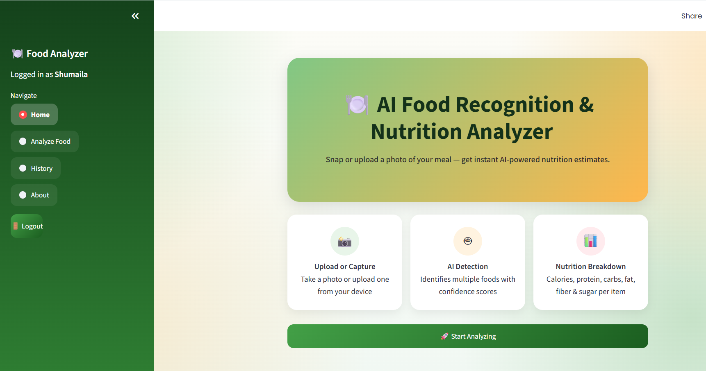
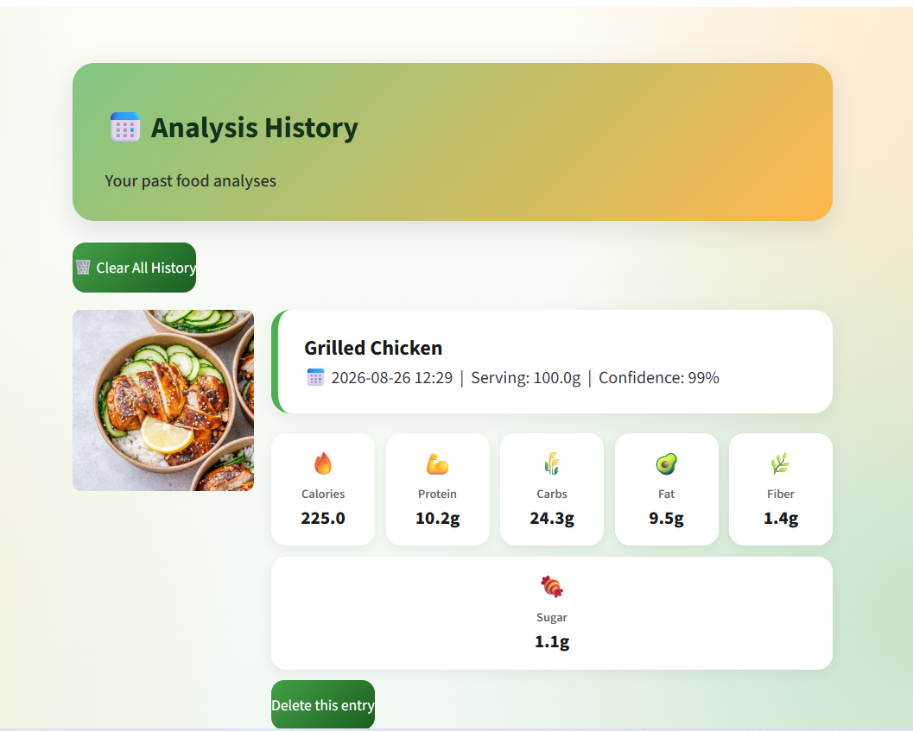

# 🍽️ AI Food Recognition & Nutrition Analyzer

An AI-powered web app that lets a user upload or capture a photo of their meal, automatically identifies the food items in it, and estimates the nutritional breakdown — calories, protein, carbs, fat, fiber, and sugar — scaled to a chosen serving size.

Built as an MVP: functional end-to-end pipeline from image upload to a saved, per-user nutrition history.

---

## Features

- **Upload or capture a food photo** (JPG/JPEG/PNG upload, or live camera capture)
- **AI food detection** with per-item confidence scores (Google Gemini Vision)
- **Multiple food detection** — a single photo can identify several items at once
- **Nutrition lookup** per detected food via the USDA FoodData Central API
- **Adjustable serving size** — nutrition values recalculate live
- **Total meal nutrition dashboard** with charts (Plotly)
- **User accounts** — signup/login with securely hashed passwords (PBKDF2-SHA256 + per-user salt)
- **Personal analysis history** — every analysis is saved per user, with the original photo, and can be deleted individually or cleared entirely
- **Transparency safeguards**:
  - Low-confidence AI detections are flagged with a warning instead of being silently trusted
  - The exact USDA database entry used for nutrition data is shown, so mismatches are visible rather than hidden
- **Error handling** for no food detected, low-confidence results, and API failures, with user-friendly messages instead of crashes

---

## Tech Stack

| Layer | Choice |
|---|---|
| Frontend / UI | Streamlit |
| AI Vision | Google Gemini (`google-genai` SDK) |
| Nutrition Data | USDA FoodData Central API |
| Database | SQLite |
| Charts | Plotly |
| Auth | PBKDF2-SHA256 password hashing (Python standard library, no extra dependency) |

---

## Setup & Installation

**1. Clone the repository**
```bash
git clone <your-repo-url>
cd <your-repo-folder>
```

**2. (Optional but recommended) Create a virtual environment**
```bash
python -m venv venv
venv\Scripts\activate      # Windows
source venv/bin/activate   # Mac/Linux
```

**3. Install dependencies**
```bash
pip install -r requirements.txt
```

**4. Set up your API keys**

Copy `.env.example` to a new file named `.env`, then fill in your real keys:
```
GEMINI_API_KEY=your_real_key_here
USDA_API_KEY=your_real_key_here
```
- Get a Gemini key: https://aistudio.google.com/apikey
- Get a USDA key: https://fdc.nal.usda.gov/api-key-signup.html

**5. Run the app**
```bash
streamlit run app.py
```

---

## Nutrition API Documentation

**Selected:** USDA FoodData Central API (`api.nal.usda.gov`)

**Why it was selected:**
- Free, official U.S. government nutrition database — reliable and well-documented
- Covers both generic foods (e.g. "Chicken, grilled") and branded products
- No cost, simple REST/JSON interface, generous rate limits with a real (non-demo) key

**What it provides:** calories, protein, carbohydrates, fat, fiber, sugar, and many other nutrients per 100g serving, which this app then scales to the user's chosen serving size.

**API key required:** Yes — free signup at the link above.

**How data is retrieved:** the detected food name is sent as a search query to `/fdc/v1/foods/search`. Since USDA's search is plain keyword matching (not semantic), this app requests multiple candidate results and scores each by word-overlap similarity to the food name, picking the best real match instead of blindly trusting the first result. The matched USDA entry name is shown to the user for transparency.

**Known limitations:**
- Keyword-based search can occasionally mismatch unusual or very short food names — mitigated with the scoring approach above, but not eliminated
- Regional, home-cooked, or mixed dishes (e.g. specific local recipes) often aren't in the database at all
- Values are per-100g reference data, not a measurement of the user's actual specific meal — treated as an estimate, not a precise reading

---

## System Architecture


The pipeline: a user uploads or captures a food photo → Streamlit handles login and the interface → Google Gemini Vision AI detects food items with confidence scores → USDA FoodData Central provides nutrition data → results are scaled to serving size, displayed on a dashboard, and saved to each user's personal history.

---

## Database Schema

**`users`** — id, username (unique), password_hash, salt, created_at

**`analysis_history`** — id, user_id, detected_food, confidence, serving_size, calories, protein, carbs, fat, fiber, sugar, image_path, created_at

---

## Screenshots

### Home


 ### Analyze Food
  
   

### History


---


## Demo Video

[Watch the demo video](https://screenrec.com/share/PHaFlkdUgp)
---

## Important Notes on Accuracy

This app does not claim medically exact nutrition values. Results depend on image quality, lighting, and how visually distinct a food is, and can vary based on actual ingredients, cooking method, and portion size — this is clearly communicated to the user throughout the app.

---

## Author

Shumaila — BS Software Engineering, Fatima Jinnah Women University